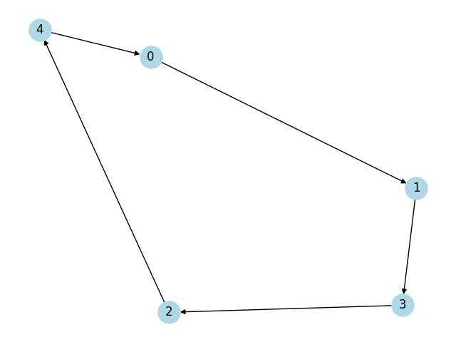
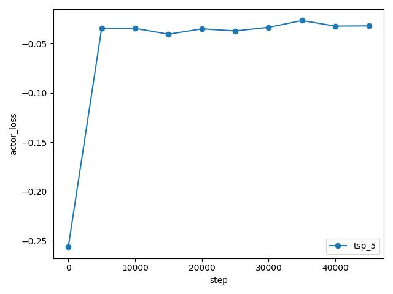
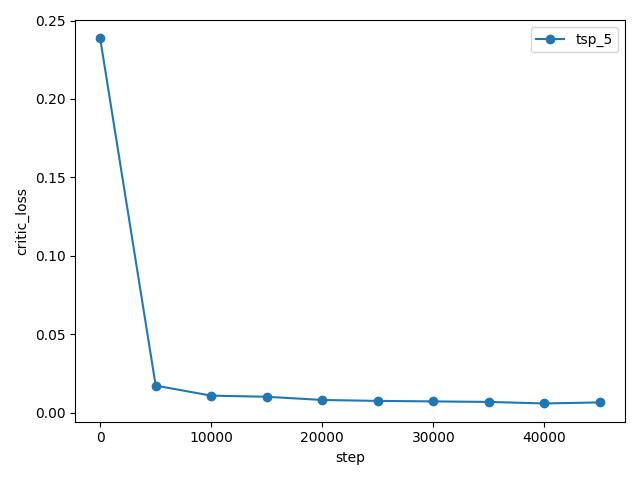
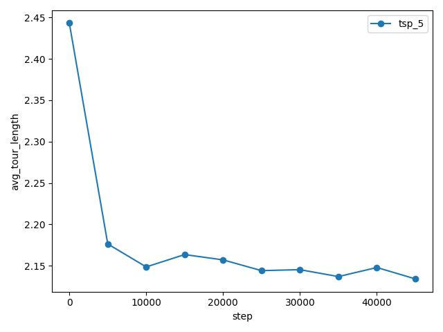

# Pointernet

Minimal implementation of [Neural Combinatorial Optimization with Reinforcement Learning](https://arxiv.org/abs/1611.09940)


## Usage

1. Install dependencies
```bash
python3 -m venv venv
source venv/bin/activate
pip3 install -r requirements.txt
cd core
```

2. Prepare the dataset
- Generate random 2D TSP coordinates of $$N$$ nodes ($$X$$)
- Solve for optimal solution, a permutation of $$N$$ nodes ($$Y$$)
```bash
make prepare
```

3. Visualize the generated data

```bash
make visualize
```



4. Train Pointernet [`Actor`](./core/lib/pointer_net/actor.py) & [`Critic`](./core/lib/pointer_net/critic.py) models to solve 1M TSP instances

To train the model
```bash
make train
```

Training data is written to
- `../data/csv/*.csv`: log optimality gap of train/test dataset, train CrossEntropyLoss
- `../data/model/*.pkl`: best model by optimality gap of train dataset

To visualize the training progress
```bash
make plot_train
```




5. Compare with other baselines in inference time on test set of 1k TSP instances

To compare solving capabilities of
[`Random`](./core/lib/solver/random.py),
[`Optimal`](./core/lib/solver/optimal.py),
[`Pretrain`](./core/lib/solver/pretrain.py),
[`Sampling`](./core/lib/solver/sampling.py),
[`Active Search`](./core/lib/solver/active_search.py)
```bash
make test
make plot_test
```
